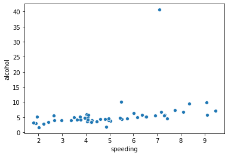
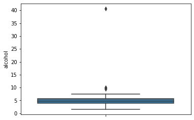
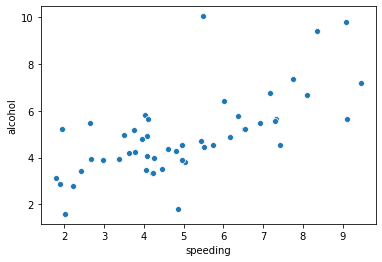
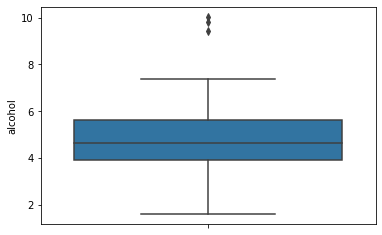

# DA_CarCrashes_MPG

## Question 3. Check if there is any outliers in the alcohol field using both scatter and boxplot


```python
sns.scatterplot(x = 'speeding', y = 'alcohol', data=crash)
```


    <matplotlib.axes._subplots.AxesSubplot at 0x266c6cabb20>


    

    


```python
sns.boxplot(y=crash['alcohol'])
```


    <matplotlib.axes._subplots.AxesSubplot at 0x266c50ab250>


    

    


## Question 4. Display and then Remove the one outlier row. You should now have 50 rows


```python
print("Before removal: ", crash.shape)

crash = crash[crash.alcohol < 20]

print("After removal: ", crash.shape)
```

    Before removal:  (51, 10)
    After removal:  (50, 10)
    


```python
sns.scatterplot(x = 'speeding', y = 'alcohol', data=crash)
```


    <matplotlib.axes._subplots.AxesSubplot at 0x266c6373850>


    

    


```python
sns.boxplot(y=crash['alcohol'])
```


    <matplotlib.axes._subplots.AxesSubplot at 0x266c68fcd90>


    

    

